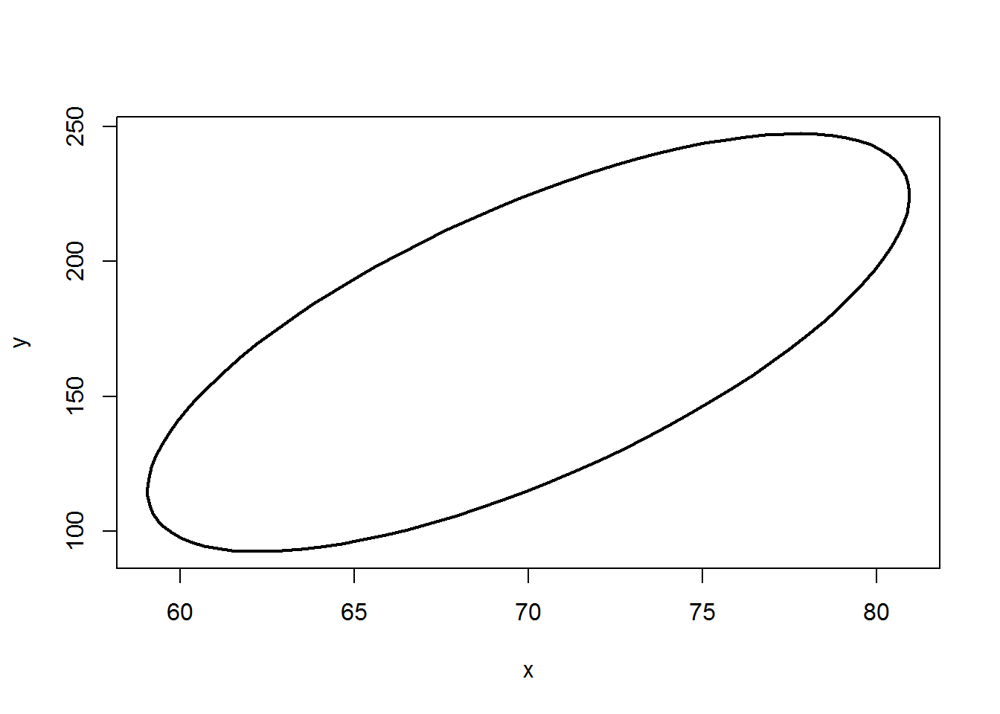

¿Cómo se construye una elipse de confianza para una normal bivariada?
=====================================================================

En muchos problemas prácticos con 2 variables se necesita crear una elipse de confianza para monitorear.

Vamos a definir el vector de medias **μ** y la matriz de covarianzas **Σ** para la cual queremos crear la elipse; el código a usar se muestra a continuación.

``` r
centro <- c(70, 170)
Sigma <- matrix(c(20, 100,
                  100, 1000), ncol=2, nrow=2)
```

``` r
require(ellipse)
level <- 0.95
p <- ellipse(x=Sigma, centre=centro, level=level)
plot(p, type = 'l', lwd=2)
```


