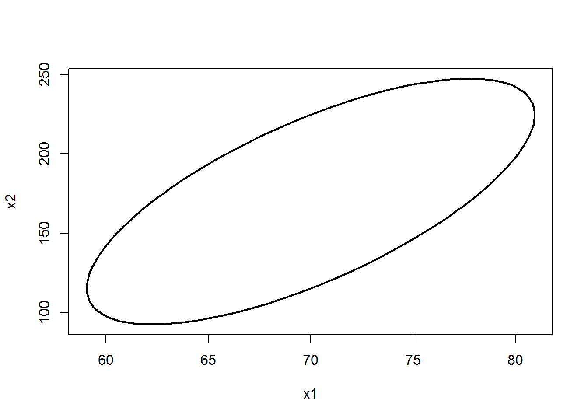

¿Cómo se construye una elipse de confianza para una normal bivariada?
=====================================================================

Existen varias funciones para dibujar elipses de confianza pero en esta publicación vamos a mostar la utilidad de la función `ellipse` del paquete [ellipse](https://cran.r-project.org/web/packages/ellipse/index.html).

``` r
require(ellipse)
```

La estructura de la función `ellipse` es la siguiente:

``` r
ellipse(x, scale = c(1, 1), centre=c(0, 0), level=0.95, 
        t=sqrt(qchisq(level, 2)), which=c(1, 2), npoints=100, ...)
```

Ejemplo 1
---------

Vamos a contruir una elipse de confianza del 95% para una distribución normal bivariada con la siguiente estructura: **μ** = (70, 170)<sup>⊤</sup>, *σ*<sub>1</sub><sup>2</sup> = 20, *σ*<sub>2</sub><sup>2</sup> = 1000 y *σ*<sub>12</sub> = 100.

Lo primero que debemos hacer es definir el vector de medias **μ** y la matriz de covarianzas **Σ** para la cual queremos crear la elipse; el código a usar se muestra a continuación.

``` r
centro <- c(70, 170)
Sigma <- matrix(c(20, 100,
                  100, 1000), ncol=2, nrow=2)
```

Luego usamos la función `elipse` e ingresando la matriz de covarianzas en el argumento `x`, el vector de medias en `centre` y la confianza requerida en `level`. A continuacón el código necesario para crear la elipse.

``` r
p <- ellipse(x=Sigma, centre=centro, level=0.95)
plot(p, type='l', lwd=2)
```


