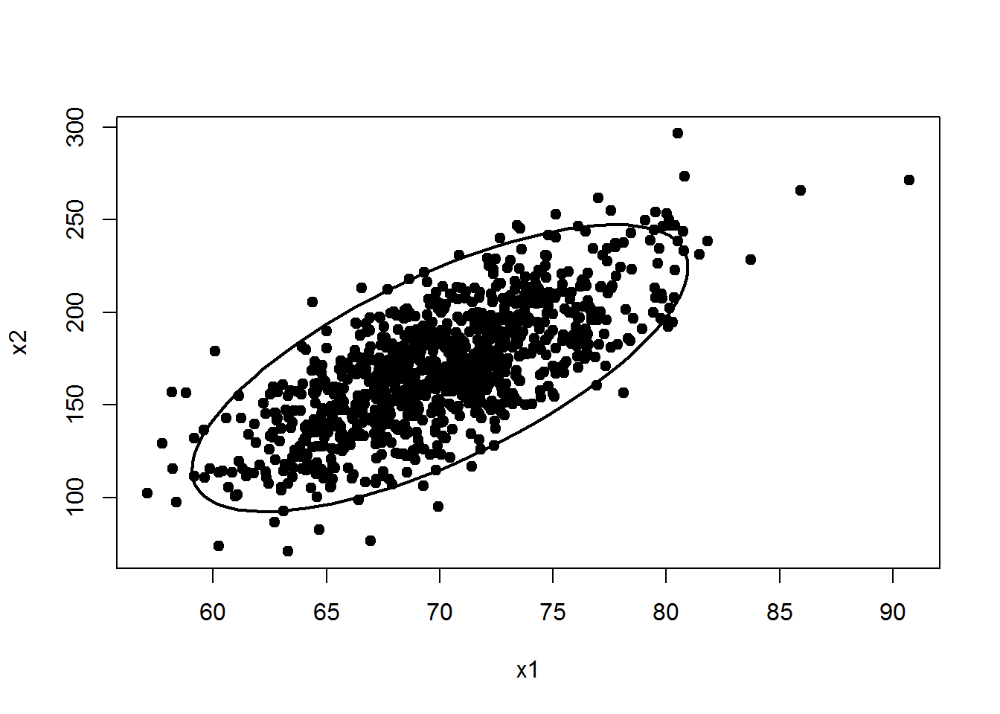
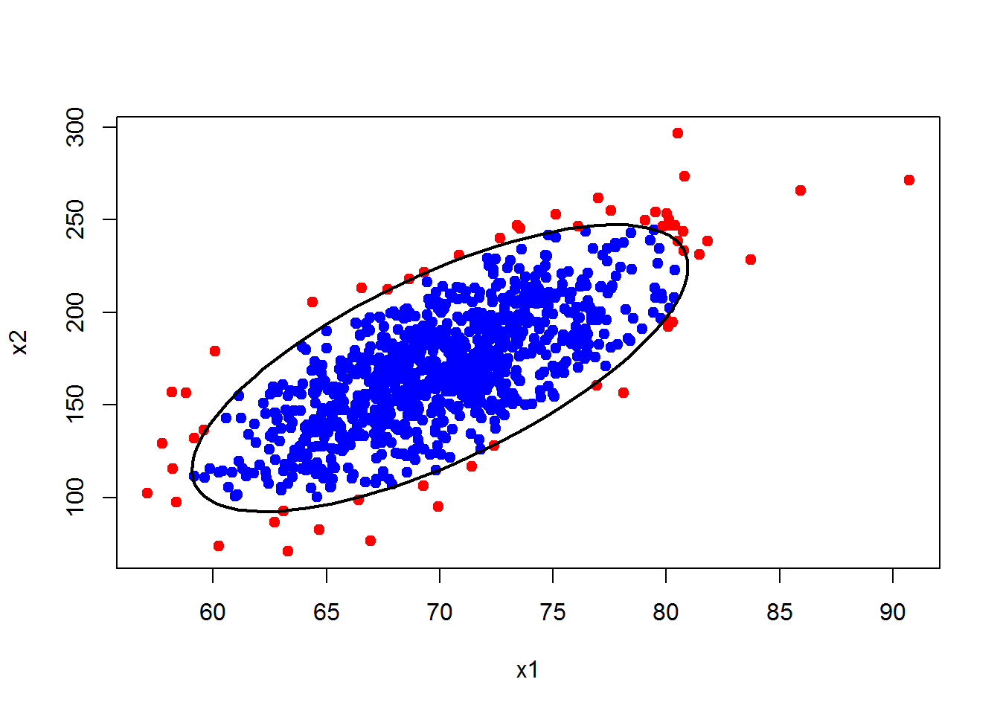

---
output:
  html_document:
    keep_md: yes
    code_download: yes
---


# ¿Cómo se construye una elipse de confianza para una normal bivariada?
Existen varias funciones para dibujar elipses de confianza pero en esta publicación vamos a mostar la utilidad de la función `ellipse` del paquete [ellipse](https://cran.r-project.org/web/packages/ellipse/index.html).


```r
require(ellipse)
```

La estructura de la función `ellipse` es la siguiente:


```r
ellipse(x, scale = c(1, 1), centre=c(0, 0), level=0.95, 
        t=sqrt(qchisq(level, 2)), which=c(1, 2), npoints=100, ...)
```

## Ejemplo 1
Vamos a contruir una elipse de confianza del 95% para una distribución normal bivariada con la siguiente estructura: $\boldsymbol{\mu}=(70, 170)^\top$, $\sigma_1^2=20$, $\sigma_2^2=1000$ y $\sigma_{12}=100$. 

Lo primero que debemos hacer es definir el vector de medias $\boldsymbol{\mu}$ y la matriz de covarianzas $\boldsymbol{\Sigma}$ para la cual queremos crear la elipse; el código a usar se muestra a continuación.


```r
centro <- c(70, 170)
Sigma <- matrix(c(20, 100,
                  100, 1000), ncol=2, nrow=2)
```

Luego usamos la función `elipse` e ingresando la matriz de covarianzas en el argumento `x`, el vector de medias en `centre` y la confianza requerida en `level`. A continuación el código necesario para crear la elipse.


```r
p <- ellipse(x=Sigma, centre=centro, level=0.95)
plot(p, type='l', lwd=2, xlab='x1', ylab='x2')
```


## Ejemplo 2. ¿Cómo estar seguro de que la elipse tiene una confianza del 95%?
Para esto vamos a simular 1000 observaciones de una normal con el vector de medias y la matriz de covarianzas definida, luego vamos a dibujar un diagrama de dispersión para después superponer la elipse de confianza. Por último contaremos los puntos que quedaron dentro y fuera de la elipse.

Para simular los datos usamos el siguiente código.

```r
require(MASS)
dt <- mvrnorm(n=1000, mu=centro, Sigma)
head(dt)  # para ver las primeras lineas
##          [,1]     [,2]
## [1,] 60.89789 120.8185
## [2,] 63.50339 176.2272
## [3,] 71.29060 196.0794
## [4,] 64.11631 155.0771
## [5,] 74.53811 194.0106
## [6,] 68.45142 136.4062
```

Para crear el diagrama de dispersión y superponer la elipse usamos el siguiente código.

```r
plot(dt, pch=19, xlab='x1', ylab='x2')
lines(p, lwd=2)
```



Para determinar el porcentaje de puntos que están dentro de la elipse podemos usar el siguiente código.


```r
d <- mahalanobis(x=dt, center=centro, cov=Sigma)
mean(d <= qchisq(p=0.95, df=2))
## [1] 0.95
```

Vemos que 95% de los puntos están dentro lo cual es un valor muy cercano al valor nominal de la elipse de 95%.

Por último vamos a dibujar los puntos que están por dentro de la elipse con color azul y los que están por fuera con color rojo.


```r
fuera <- ifelse(d <= qchisq(p=0.95, df=2), 1, 2)
plot(dt, pch=19, col=c('blue', 'red')[fuera], xlab='x1', ylab='x2')
lines(p, lwd=2)
```




```r
stop('This should break!')
```


<div class="alert alert-danger">
**Error** in eval(expr, envir, enclos): This should break!

</div>

```r
warning('Watch out!')
```


<div class="alert alert-warning">
**Warning** Watch out!

</div>

```r
message('This is a message for you')
```


<div class="alert alert-info">

 This is a message for you

</div>
