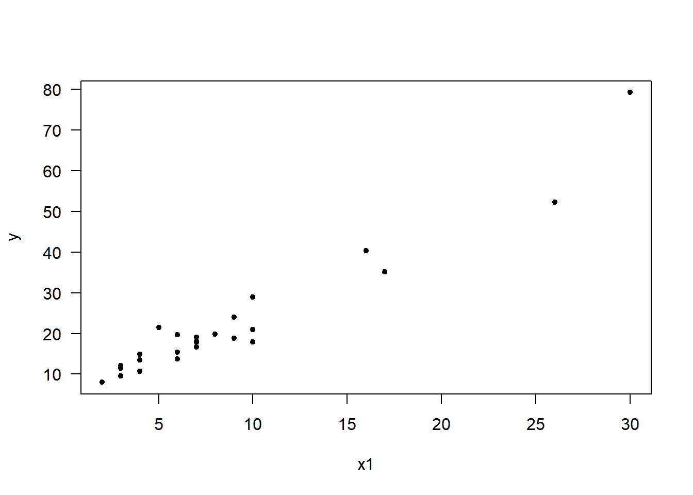
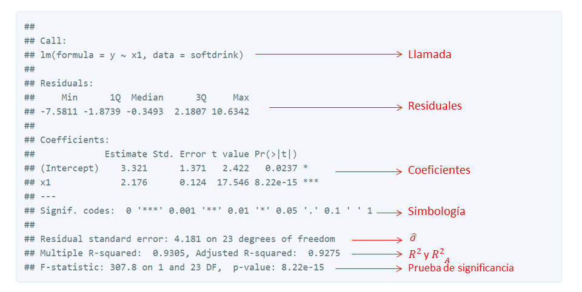
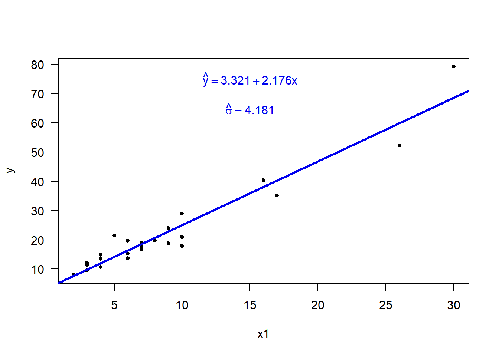
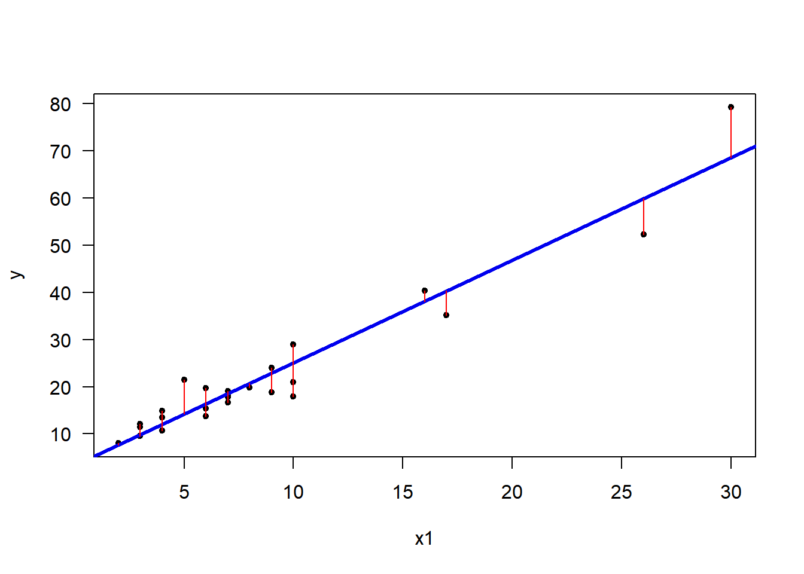
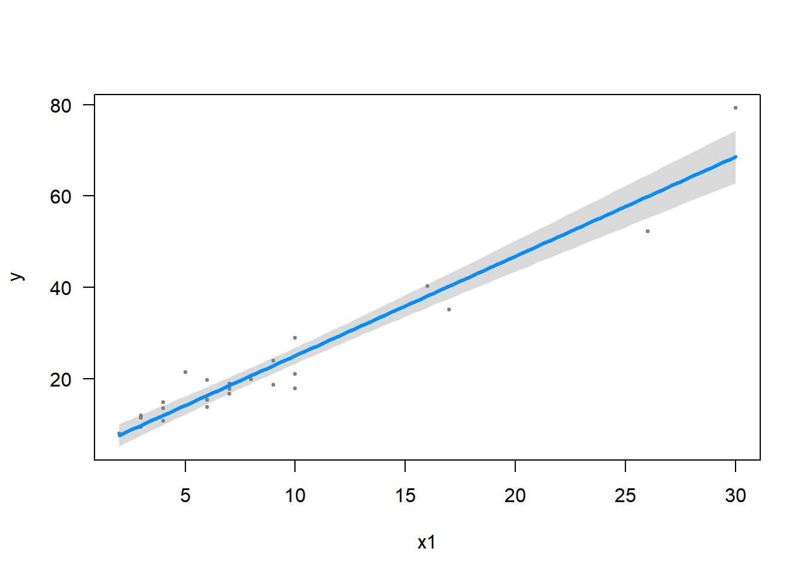

<hr>


<hr>

Introducción
============

En esta publicación se mostrará como usar las herramientas de R para ajustar un modelo de regresión lineal simple.

Modelo estadístico
==================

El modelo estadístico en regresión lineal simple se puede escribir de dos formas como se muestra a continuación.

-   Modelo 1: en esta forma la variable respuesta *y* se expresa como una suma de *β*<sub>0</sub> + *β*<sub>1</sub>*x*<sub>*i*</sub> y un error aleatorio *e*<sub>*i*</sub> el cual tiene distribución *N*(0, *σ*<sup>2</sup>).
-   Modelo 2: en esta forma la variable respuesta *y* tiene distribución *N*(*β*<sub>0</sub> + *β*<sub>1</sub>*x*<sub>*i*</sub>, *σ*<sup>2</sup>).

En cualquiera de los dos casos anteriores el vector de parámetros del modelo es **θ** = (*β*<sub>0</sub>, *β*<sub>1</sub>, *σ*)<sup>⊤</sup>.

Datos para el ejemplo
=====================

Para el ejemplo vamos a utilizar los datos disponibles en el objeto `softdrink` del paquete `MPV` que acompaña al libro [Introduction to Linear Regression Analysis](https://www.amazon.com/Introduction-Regression-Analysis-Douglas-Montgomery/dp/0470542810/ref=sr_1_1?s=books&ie=UTF8&qid=1513908927&sr=1-1&refinements=p_27%3AMontgomery+%2F+Peck+%2F+Vining).

Los datos `softdrink` corresponden al tiempo (*y*) que un empleado demora para revisar y surtir una máquina dispensadora en función de la cantidad de cajas (*x*) que surte a la máquina, abajo una figura ilustrativa de la situación.


A continuación se muestra cómo acceder a la base de datos `softdrink` del paquete `MPV` y se muestra también el encabezado (head) de la base de datos.

``` r
require(MPV)
head(softdrink)
##       y x1  x2
## 1 16.68  7 560
## 2 11.50  3 220
## 3 12.03  3 340
## 4 14.88  4  80
## 5 13.75  6 150
## 6 18.11  7 330
```

A continuación se crea un gráfico de dispersión entre las variables tiempo (*y*) y número de cajas (*x*<sub>1</sub>).

``` r
with(softdrink, plot(x=x1, y=y, pch=20, las=1))
```


<p class="caption">
Diagrama de dispersión entre el tiempo (*y*) y el número de cajas (*x*<sub>1</sub>).
</p>

De la figura anterior se observa que hay una relación entre el tiempo y el número de cajas porque la nube de puntos muestra que a mayor número de cajas se require más tiempo para finalizar el servicio del dispensador. Al calcular el coficiente de correlación entre las variables se encuentra que es de 0.9646146.

De la figura anterior es razonable pensar que el modelo estadístico que relaciona las variables *y* e *x*<sub>1</sub> es:

*y*<sub>*i*</sub> = *β*<sub>0</sub> + *β*<sub>1</sub>*x*<sub>1*i*</sub> + *e*<sub>*i*</sub>

Función `lm`
============

La función `lm` (linear modeling) permite ajustar un modelo de regresión lineal, la estructura de la función con los parámetros más usuales se muestra a continuación.

``` r
lm(formula, data, subset, weights)
```

Los parámetros de la función `lm` son:

-   `formula`: es una fórmula usual con la forma `y ~ x1 + x2`, en el lado izquierdo está la variable respuesta `y` en el lado derecho las covariables del modelo.
-   `data`: es el dataframe que contiene los datos para ajustar el modelo.
-   `subset`: este parámetro opcional se usa para incluir una condición y así crear un subconjunto del dataframe que contiene los datos.
-   `weights`: vector opcional con los pesos *w*<sub>*i*</sub> para minimizar ∑(*w*<sub>*i*</sub>*e*<sub>*i*</sub><sup>2</sup>), si no se ingresan pesos se usará mínimos cuadrados ordinarios para la estimación.

Usando la función `lm` para ajustar el modelo.
==============================================

Para ajustar el modelo *y*<sub>*i*</sub> = *β*<sub>0</sub> + *β*<sub>1</sub>*x*<sub>1*i*</sub> + *e*<sub>*i*</sub> en R usamos el siguiente código.

``` r
mod <- lm(y ~ x1, data=softdrink)
```

Lo usual cuando se ajusta un modelo lineal con la función `lm` es almacenar los resultados en un objeto con un nombre cualquiera, aquí decidimos usar el nombre `mod` para bautizar el objeto pero se pudo haber usado cualquier otro.

Al ajustar el modelo en el código anterior se observa que en la fórmula `y ~ x1` sólo van las variables que interviene en el modelo, no se debe colocar nada sobre los coeficientes *β*.

Para obtener una tabla resumen con los resultados del modelo ajustado se puede aplicar la función `summary` al objeto `mod`, a continuación se muestra la tabla de resumen obtenida con el código `summary(mod)`.



En la salida anterior se tiene información valiosa del modelo ajustado. Lo que primero se observa es la llamada o call del modelo que informa sobre cuál fue el modelo ajustado. Lo segundo que aparece en la salida es un resumen de los residuales del modelo usando los cinco números de Tukey (mínimo, Q1, mediana, Q3 y máximo). Lo tercero que se observa son los coeficientes estimados del modelo $\\hat{\\beta}\_0$ y $\\hat{\\beta}\_1$, sus errores estándar, los valores *t* y el valor-P. Luego aparece una simbología de estrellas y puntos que ayudan a identificar rápidamente si una covariable es marginalmente importante en el modelo, entre más estrellas tenga una covariable más importante es en el modelo. Por último, en la salida anterior se encuentra un bloque que contiene el valor estimado de *σ*, los valores de *R*<sup>2</sup> y *R*<sub>*A*</sub><sup>2</sup>, y el resultado de la prueba de significancia de la regresión.

Utilizando la información de la salida anterior se puede escribir el modelo ajustado así

$$\\hat{y}\_i = 3.321 + 2.176 x\_{1i}$$
 con una desviación estimada para los errores de $\\hat{\\sigma}=4.181$. Así el vector estimado de parámetros del modelo es $\\hat{\\boldsymbol{\\theta}}=(3.321, 2.176, 4.181)^\\top$.

Elementos del objeto `mod`
==========================

El objeto `mod` es una lista que sirve para almacenar los resultados del modelo ajustado con la función `lm`. Algunos de los elementos más utilizados de la lista son los siguientes:

-   `coefficients`: vector con los valores estimados de los *β*´s.
-   `residuals`: vector con los residuales $e\_i=y\_i-\\hat{y}\_i$.
-   `fitted.values`: vector con los valores ajustados $\\hat{y}\_i$.
-   `rank`: valor numérico con el rango del modelo.

Para consultar todos los elementos que están dentro de `mod` se puede escribir en la consola `names(mod)`, y si necesita por ejemplo consultar el vector de coeficientes basta con escribir en la consola lo siguiente:

``` r
mod$coefficients
## (Intercept)          x1 
##    3.320780    2.176167
```

Elementos del objeto `summary(mod)`
===================================

Al igual que `mod`, el objeto `summary(mod)` también almacena los resultados de la tabla resumen, para ver lo que se encuentra allí dentro se usa el código:

``` r
names(summary(mod))
##  [1] "call"          "terms"         "residuals"     "coefficients" 
##  [5] "aliased"       "sigma"         "df"            "r.squared"    
##  [9] "adj.r.squared" "fstatistic"    "cov.unscaled"
```

Por ejemplo, si se desea extraer el valor estimado para *σ* se puede escribir en la consola:

``` r
summary(mod)$sigma
## [1] 4.181397
```

y vemos que el valor obtenido coincide con el reportado en la tabla de resumen anteriormente mostrada.

Agregando la línea ajustada y los errores
=========================================

Luego de ajustar el modelo es usual presentar el diagrama de dispersión con la línea que representa el modelo ajustado, en este caso la línea que representa la ecuación $\\hat{y}\_i = 3.321 + 2.176 x\_{1i}$. Para agregar la línea se usa la función `abline` aplicada al modelo `mod`, es decir `abline(mod)`. Abajo se muestra el código para dibujar el diagrama de dispersión inicial, para agregar una línea azul de grosor 3 que representa el modelo ajustado y para incluir la ecuación del modelo ajustado.

``` r
with(softdrink, plot(x=x1, y=y, pch=20, las=1))
abline(mod, lwd=3, col='blue2')
text(x=15, y=75, expression(hat(y)==3.321 + 2.176 * x), col='blue2')
text(x=15, y=65, expression(hat(sigma)==4.181), col='blue2')
```


<p class="caption">
Diagrama de dispersión entre el tiempo (*y*) y el número de cajas (*x*<sub>1</sub>) agregando el modelo ajustado
</p>

Para complementar el diagrama de dispersión anterior se acostumbra a presentar los residuales o errores *e*<sub>*i*</sub> del modelo, para realizar esto se puede utilizar el código mostrado a continuación. En este código se construyen tres vectores auxiliares `yhat` con los valores ajustados $\\hat{y}\_i$, los valores de *y* y los valores de *x*.

``` r
with(softdrink, plot(x=x1, y=y, pch=20, las=1))
abline(mod, lwd=3, col='blue2')
yhat <- mod$fitted.values
y <- softdrink$y
x <- softdrink$x1
for (i in 1:length(yhat)) 
  segments(x0=x[i], y0=y[i], x1=x[i], y1=yhat[i], col='red')
```


<p class="caption">
Diagrama de dispersión entre el tiempo (*y*) y el número de cajas (*x*<sub>1</sub>) agregando el modelo ajustado y los residuales
</p>

De la figura anterior se observan los residuales $e\_i=y\_i-\\hat{y}\_i$ en color rojo para destacarlos, algunos de ellos son positivos (subestimación) y otros negativos (sobreestimación).

Predicciones
============

Una predicción $\\hat{y}$ o valor estimado para *y* dado un valor de *x* se obtiene utilizando el modelo ajustado $\\hat{y}=\\hat{\\beta}\_0+\\hat{\\beta}\_1 x$ y reemplazando *x* por el valor observado y realizando las operaciones. En R los valores ajustados se pueden obtener fácilmente dependiendo de si el o los valores de *x* están en la base de datos original o no.

-   Si los valores de *x* están en la base de datos los valores de $\\hat{y}$ se pueden obtener de tres formas diferentes: escribiendo `fitted(mod)` o `fitted.values(mod)` o `mod$fitted.values`.
-   Si los valores de *x* son nuevos y no están en la base de datos se puede usar la función `predict` en la cual hay que definir el modelo de referencia y el nuevo dataframe.

Por ejemplo, supongamos que queremos estimar el valor de *y* para los valores de *x* = 12, 20, 27 que NO están en la base de datos original. Para hacer esto en forma rápida debemos crear un nuevo dataframe en donde la variable se llame igual que en el modelo `mod` y que contenga los valores de *x*, luego se usa la función `predict` como se muestra a continuación para obtener los $\\hat{y}$.

``` r
nuevo <- data.frame(x1=c(12, 20, 27))
predict(object=mod, newdata=nuevo)
##        1        2        3 
## 29.43478 46.84411 62.07728
```

De la anterior salida podemos concluir que cuando *x* = 12 el valor estimado $\\hat{y}=29.43478$ y así sucesivamente.

Intervalos de confianza
=======================

En R podemos obtener intervalos de confianza para los parámetros *β*<sub>*k*</sub> de una forma rápida por medio de la función `confint`. A continuación se muestra cómo usar esa función para calcular un intervalo de confianza del 92% para el parámetro *β*<sub>1</sub> del ejemplo.

``` r
confint(object=mod, parm='x1', level=0.92)
##         4 %     96 %
## x1 1.948998 2.403335
```

Si se desea obtener un intervalo de confianza para el intercepto del modelo se debe escribir `parm='(Intercept)'`, a continuación un ejemplo.

``` r
confint(object=mod, parm='(Intercept)', level=0.92)
##                   4 %     96 %
## (Intercept) 0.8095671 5.831993
```

Bandas de confianza
===================

Las bandas de confianza se pueden obtener fácilmente por medio de la función `visreg` del paquete visreg. A continuación un ejemplo.

``` r
require(visreg)
visreg(fit=mod, xvar='x1')
```


<p class="caption">
Bandas de confianza
</p>

<hr>
<p align="center"> Fin </p>
