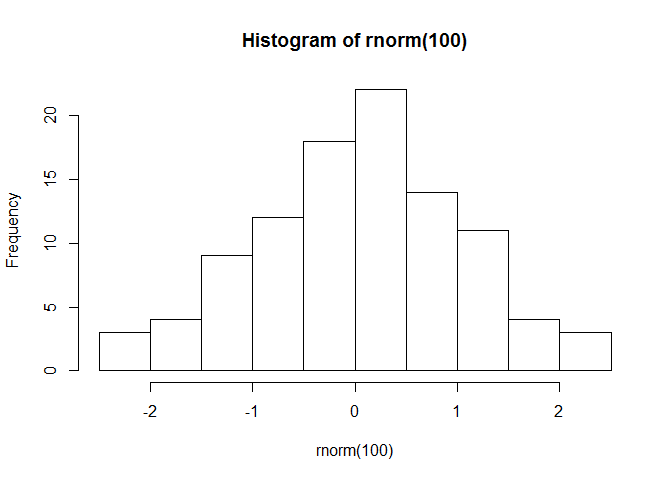

## R Markdown
Esta es mi prueba de ecuaciones $E = mc^2$.

$$\begin{array}{ccc}
x_{11} & x_{12} & x_{13}\\
x_{21} & x_{22} & x_{23}
\end{array}$$


```r
summary(rnorm(n=100))
```

```
##    Min. 1st Qu.  Median    Mean 3rd Qu.    Max. 
## -3.1296 -0.7494 -0.1606 -0.1317  0.6217  2.3055
```


<!-- -->

## Quarterly Results {.tabset}

### By Product

(tab content)

### By Region

(tab content)
