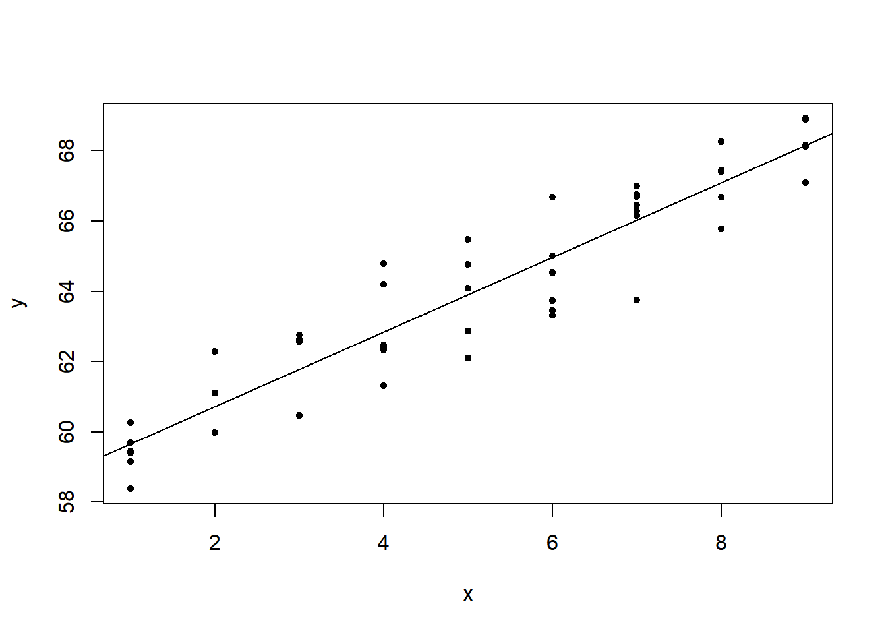

<hr>


<hr>

Introducción
------------

En esta publicación se mostrará cómo simular datos de un:
1. Modelo lineal clásico,
2. Modelo lineal con intercepto aleatorio,
3. Modelo lineal con pendiente aleatoria,
4. Modelo lineal con intercepto y pendiente aleatoria.

Ilustración de un modelo mixto
------------------------------

Recomiendo al lector que visite el enlace mostrado abajo para que vea una ilustración muy interesante de modelos mixtos.

<http://mfviz.com/hierarchical-models/>

Simulando datos de modelo tradicional
-------------------------------------

Suponga que queremos simular *n* = 50 observaciones del siguiente modelo:

$$\\begin{array}{ccc}
x\_{11} & x\_{12} & x\_{13}\\\\
x\_{21} & x\_{22} & x\_{23}
\\end{array}$$

$$X = \\begin{bmatrix}1 & x\_{1}\\\\
1 & x\_{2}\\\\
1 & x\_{3}
\\end{bmatrix}$$

Con el siguiente código se simula un conjunto de datos como los deseados.

``` r
n <- 50
desvi <- 1

x <- sample(1:9, size=n, replace=TRUE)
media <- 59 + 1 * x
y <- rnorm(n=n, mean=media, sd=desvi)
```

Dibujemos los datos simulados.

``` r
plot(y ~ x, pch=20)
```


Ajustemos un modelo para recuperar los parámetros.

``` r
mod <- lm(y ~ x)
c(mod$coef, summary(mod)$sigma)
```

    ## (Intercept)           x             
    ##   58.592562    1.061205    1.013266

``` r
plot(y ~ x, pch=20)
abline(mod)
```



<hr>
<p align="center"> Fin </p>
