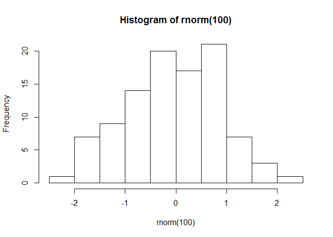

## R Markdown
Esta es mi prueba

$$\begin{array}{ccc}
x_{11} & x_{12} & x_{13}\\
x_{21} & x_{22} & x_{23}
\end{array}$$


```r
summary(rnorm(n=100))
```

```
##     Min.  1st Qu.   Median     Mean  3rd Qu.     Max. 
## -2.12827 -0.56162  0.11123  0.08095  0.65633  2.61060
```


<!-- -->


